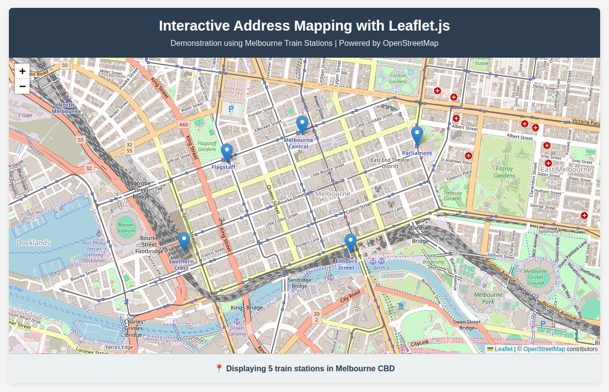

# Interactive Address Mapping with Leaflet.js

A lightweight, single-file demonstration of how to plot addresses on an interactive map using OpenStreetMap and Leaflet.js. This project showcases Melbourne train stations as an example of location-based data visualization.

**You are most welcome to use this code in your commercial projects, all that I ask in return is that you credit my work by providing a link back to this repository. Thank you & Enjoy!**




## 🗺️ Live Demo

Simply open `leaf.html` in your web browser to see the interactive map in action.

## ✨ Features

- **Zero Configuration**: No build tools or server setup required
- **Interactive Markers**: Click on any station marker to see location details
- **Responsive Design**: Works on desktop and mobile devices
- **Lightweight**: Single HTML file with minimal dependencies
- **Customizable**: Easy to modify for different locations and data

## 🚀 Quick Start

1. **Clone the repository**
   ```bash
   git clone https://github.com/yourusername/leaflet-address-mapper.git
   cd leaflet-address-mapper
   ```

2. **Open in browser**
   ```bash
   # Simply open the HTML file
   open leaf.html
   # or on Linux
   xdg-open leaf.html
   # or on Windows
   start leaf.html
   ```

3. **Customize for your needs**
   - Edit the `addresses` array in `leaf.html`
   - Update coordinates and location names
   - Modify map center and zoom level

## 📍 Adding Your Own Locations

To add new locations, simply modify the `addresses` array in `leaf.html`:

```javascript
var addresses = [
    { address: 'Your Location Name', lat: -37.8183, lon: 144.9671 },
    { address: 'Another Location', lat: -37.8182, lon: 144.9526 },
    // Add more locations here
];
```

### Getting Coordinates

1. **Google Maps**: Right-click on a location → "What's here?" → Copy coordinates
2. **OpenStreetMap**: Click on a location → See coordinates in the URL
3. **GPS Tools**: Use any GPS coordinate finder online

## 🛠️ Customization Options

### Map Settings
- **Center Point**: Modify `setView([-37.8150, 144.9631], 15)`
- **Zoom Level**: Change the number (1-19, where 19 is most detailed)
- **Map Size**: Adjust `#map { height: 600px; }` in the CSS

### Marker Styling
- **Popup Content**: Modify the `bindPopup()` method
- **Custom Icons**: Add custom marker icons using Leaflet's icon API
- **Marker Clustering**: Implement for large datasets

### Map Tiles
Replace OpenStreetMap with other providers:
```javascript
// Example: Satellite imagery
L.tileLayer('https://server.arcgisonline.com/ArcGIS/rest/services/World_Imagery/MapServer/tile/{z}/{y}/{x}')
```

## 📦 Dependencies

- **Leaflet.js**: v1.9+ (loaded via CDN)
- **OpenStreetMap**: Tile provider (free, no API key required)

## 🌍 Use Cases

- **Business Locations**: Plot store or office locations
- **Event Planning**: Show venue locations for conferences or meetups
- **Travel Planning**: Mark points of interest for trips
- **Data Visualization**: Display geographic datasets
- **Educational Projects**: Teach mapping concepts


## 🙏 Acknowledgments

- [Leaflet.js](https://leafletjs.com/) - Amazing open-source mapping library
- [OpenStreetMap](https://www.openstreetmap.org/) - Free, editable map data